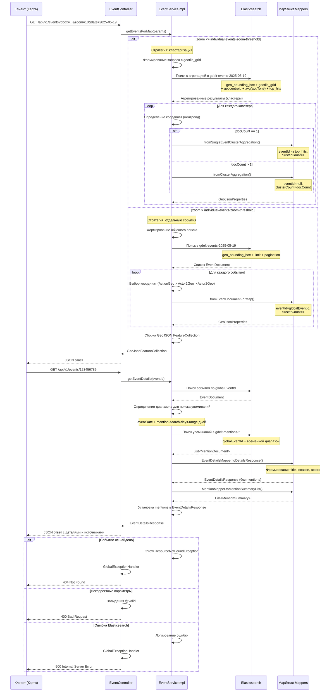

# Сервис отображения событий на карте (em-api)

Микросервис `em-api` отвечает за предоставление REST API для интерактивного отображения событий GDELT на географической карте. Сервис поддерживает кластеризацию событий, фильтрацию по времени и области карты, визуализацию эмоционального тона и получение детальной информации о событиях с их медийным освещением.

## Основной рабочий процесс

1. **Получение запроса событий для карты:**
   * Клиент (фронтенд карты) отправляет GET-запрос к `/api/v1/events` с параметрами фильтрации: временной диапазон (`since`/`until` или `date`), границы видимой области карты (`bbox`) и текущий уровень масштабирования (`zoom`).
   * По умолчанию, если временные параметры не указаны, используется период последних 24 часов.

2. **Формирование запроса к Elasticsearch:**
   * `EventServiceImpl` анализирует параметры и выбирает соответствующие ежедневные индексы Elasticsearch (`gdelt-events-YYYY-MM-DD`).
   * Применяется географический фильтр `geo_bounding_box` по полю координат события для ограничения выборки текущей областью карты.
   * В зависимости от уровня `zoom` определяется стратегия обработки:
     * **Высокий zoom** (> `individual-events-zoom-threshold`): возвращаются отдельные события без кластеризации
     * **Низкий/средний zoom**: применяется серверная кластеризация с помощью агрегации `geotile_grid`

3. **Серверная кластеризация (при необходимости):**
   * Используется агрегация `geotile_grid` с precision, соответствующим уровню масштабирования карты.
   * Для каждого кластера (ячейки сетки) вычисляются подагрегации:
     * `geocentroid` — координаты центра кластера
     * `avg` по полю `avgTone` — средний эмоциональный тон событий в кластере
     * `top_hits` с `size: 1` — получение одного события из кластера (для кластеров из одного события)

4. **Выбор оптимальных координат события:**
   * Для каждого события применяется логика выбора наиболее точных координат:
     * **Приоритет 1:** `ActionGeo` (место действия события), если тип точности > 1 (точнее уровня страны)
     * **Приоритет 2:** `Actor1Geo`, если `ActionGeo` недостаточно точен и `Actor1Geo` имеет тип > 1
     * **Приоритет 3:** `Actor2Geo`, если предыдущие варианты неприменимы
     * **Резервный:** `ActionGeo` даже при низкой точности, если других вариантов нет

5. **Формирование GeoJSON ответа:**
   * Результаты преобразуются в формат GeoJSON FeatureCollection с помощью MapStruct мапперов.
   * Каждая фича содержит:
     * `geometry`: точка с координатами (центроид для кластера или координаты события)
     * `properties`: 
       * `clusterCount` — количество событий (1 для отдельного события, >1 для кластера)
       * `avgTone` — эмоциональный тон для визуализации цветом
       * `eventId` — идентификатор события (только для `clusterCount = 1`)

6. **Получение детальной информации о событии:**
   * При клике на отдельное событие на карте, фронтенд запрашивает `GET /api/v1/events/{eventId}`.
   * `EventServiceImpl` находит событие по `globalEventId` в соответствующем индексе.
   * Выполняется поиск упоминаний события в индексах `gdelt-mentions-*` за период: дата события + `mention-search-days-range` дней.
   * Формируется детальный ответ с основной информацией о событии и списком медийных источников.

7. **Визуализация эмоционального тона:**
   * Поле `avgTone` в ответе используется фронтендом для цветовой индикации событий/кластеров на карте.
   * Отрицательные значения (негативные события) → красные оттенки
   * Положительные значения (позитивные события) → зеленые/синие оттенки
   * Нейтральные значения (около 0) → желтые/белые оттенки

## Обработка ошибок

* **404 Not Found:** Событие с указанным ID не найдено (`ResourceNotFoundException`)
* **400 Bad Request:** Некорректные параметры запроса (неверный формат даты, невалидные значения)
* **500 Internal Server Error:** Ошибки подключения к Elasticsearch, внутренние ошибки обработки
* **Временные ограничения:** Запросы данных старше 30 дней возвращают пустой результат (данные удаляются согласно ILM-политике Elasticsearch)

## Масштабируемость и производительность

* **Ежедневные индексы:** Разделение данных по дням позволяет ограничивать поиск только нужными индексами
* **Географическая фильтрация:** `geo_bounding_box` существенно сокращает объем обрабатываемых данных
* **Адаптивная кластеризация:** Автоматическое переключение между кластеризованным и детальным отображением в зависимости от масштаба
* **Ленивая загрузка:** Данные запрашиваются только для видимой области карты и текущего временного диапазона

## API Endpoints

### `GET /api/v1/events`
Получение событий/кластеров для отображения на карте

**Параметры запроса:**
- `since` (optional): начальная дата диапазона (YYYY-MM-DD)
- `until` (optional): конечная дата диапазона (YYYY-MM-DD) 
- `date` (optional): конкретная дата (YYYY-MM-DD)
- `bbox` (optional): границы области "minLat,minLon,maxLat,maxLon"
- `zoom` (optional): уровень масштабирования карты

**Ответ:** GeoJSON FeatureCollection

### `GET /api/v1/events/{eventId}`
Получение детальной информации о событии

**Параметры:**
- `eventId`: глобальный идентификатор события

**Ответ:** JSON с деталями события и списком упоминаний

## Диаграмма последовательности (клик на кнопку ⟷ развернет схему)

